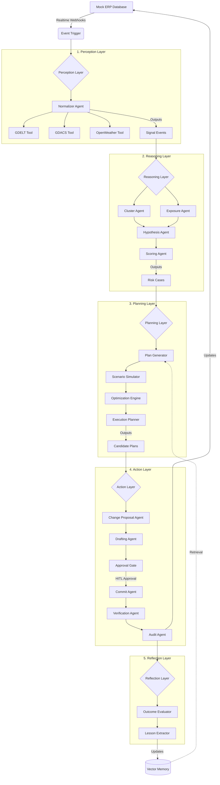

# Omni Agent Architecture

## High-Level Pipeline

Omni consists of five primary agent layers, implemented via the Google Gen AI SDK (ADK). The system continuously polls for external disruptions, reasons about supply chain exposure, generates mitigation plans, and stages ERP changes for human approval.

## Agent Responsibilities

1. **Perception**: Interacts with the outside world via `FunctionTool` calls to public APIs (OpenWeather, GDACS, GDELT). Normalizes disparate news into standard `SignalEvent` models stored in Supabase.
2. **Reasoning**: Fuses multiple `SignalEvents` into distinct `EventClusters`. Maps these clusters to internal ERP entities (Suppliers, Routes, Facilities) to calculate exposure. Evaluates a mathematical risk score based on the `/agents/reasoning/risk_policy.yaml`.
3. **Planning**: Uses the `/agents/planning/action_library.yaml` to propose concrete mitigation strategies (e.g., Expedite Air Freight, Reroute Shipment). Simulates the cost/benefit of each plan and selects a recommended course of action.
4. **Action**: Translates the high-level plan into a literal JSON diff against the ERP API schema (`ChangeProposal`). Blocks on human-in-the-loop (HITL) authorization. If approved, executes the change, verifies the state, and writes to an immutable Audit Log.
5. **Reflection**: Compares the predicted risk reduction to the actual observed reality. Extracts generalized patterns (e.g., "Air freight during typhoons is less effective") and stores them in Supabase, which the Planning layer consults on future runs.
