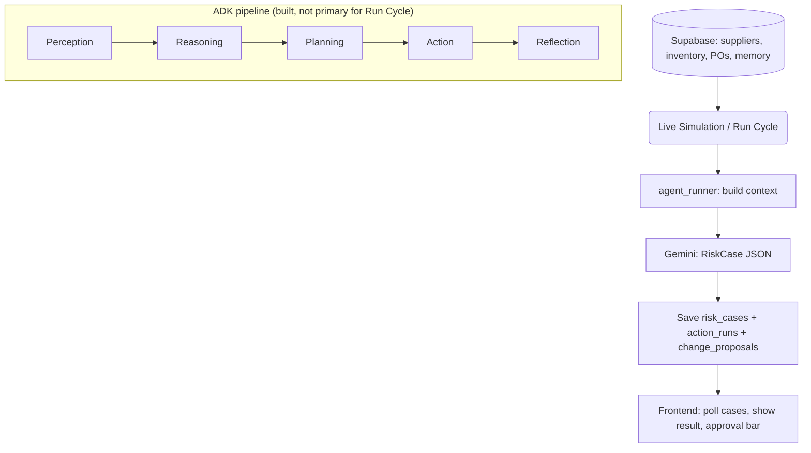

# Omni Agent Architecture

## High-Level Pipeline

Omni is designed around five agent layers (Perception → Reasoning → Planning → Action → Reflection). The **current production path** for Live Simulation uses a **direct Gemini risk-assessment flow** that reads live Supabase data and returns a RiskCase; the full ADK pipeline is implemented in code but not yet the primary execution path for the Run Cycle button.

## What Is Implemented Today

| Layer / Component | Status | Notes |
|-------------------|--------|--------|
| **Live Simulation risk assessment** | ✅ | Real data from Supabase → Gemini prompt → parse JSON → save `risk_cases`; sliders influence scores; approval bar from `recommended_plan`. |
| **Configuration** | ✅ | Company profile (memory_preferences), Suppliers and Facilities CRUD from Supabase. |
| **Risk Cases tab** | ✅ | Table + inline expand; scores, hypotheses, plans, execution steps, audit trail; Supabase or API fallback. |
| **Activity Log** | ✅ | `audit_log` table; auto-refresh; case_id links. |
| **Chatbot** | ✅ | Internal data + optional commodity prices (Alpha Vantage) + Google Search grounding; `POST /api/chat`. |
| **Events Feed** | ✅ | Reads `signal_events`. |
| **Actions / Approvals** | ✅ | List pending `change_proposals`; approve/reject via API; no commit execution yet. |
| **ADK agent definitions** | ✅ | Perception, Reasoning (cluster, exposure, hypothesis, scoring), Planning, Action (change proposal, drafting, approval, commit, verification, audit), Reflection; all use valid LlmAgent/SequentialAgent/ParallelAgent params. |
| **Full ADK pipeline execution** | ⏳ | Pipeline is built in `root_agent.py` but Run Cycle uses `agent_runner.run_risk_assessment()` instead. Full pipeline can be wired for batch/scheduled runs. |
| **Action layer execution** | ⏳ | Change proposals are created and approved in UI; **commit to ERP**, **verification**, and **audit** are not yet triggered end-to-end. |
| **Draft emails / notifications** | ⏳ | Drafting Agent and `draft_artifacts` exist; no UI to view or send drafts. |
| **User notifications (ping)** | ⏳ | No email or in-app ping when cases or proposals are created. |

## Agent Responsibilities (Reference)

1. **Perception** — External signals (GDACS, GDELT, OpenWeather, etc.) via tools; normalizer writes `signal_events` to Supabase.
2. **Reasoning** — Cluster signals, exposure mapping, hypothesis and scoring; produces RiskCase (in full ADK flow).
3. **Planning** — Action library + scenario simulation; recommended and alternative plans.
4. **Action** — Change proposal → drafting → HITL approval → commit → verification → audit. **Currently**: proposals created and approved; commit/verify/audit need to be wired.
5. **Reflection** — Outcome evaluation and lesson extraction into memory for future planning.

## Next Steps (Architecture)

- **Incorporate action layer end-to-end**: On approve, call Commit Agent (or equivalent) to push changes to ERP; then Verification and Audit agents, and write `audit_log` with `case_id`.
- **Draft emails**: Surface `draft_artifacts` in UI; allow “Send” or edit-then-send (e.g. via email API or Slack).
- **Ping notifications**: On new high-severity risk case or pending proposal, notify configured users (email, in-app, or webhook).
- **Optional full ADK run**: Use `run_omni_pipeline` (or equivalent) for scheduled/batch runs so Perception → Reflection runs with real tool calls and shared state.
- **Context propagation**: Ensure `case_id` / `proposal_id` are passed through the pipeline and appear in `audit_log` and approval flows.

For UI-to-API and table mapping, see `ui-mapping.md`.
