# Omni — Implementation Flow

High-level flow from **Users** through **Frontend**, **Backend**, **Database**, **Gemini (LLM)**, and **Google ADK** (agent framework). Use this as a design reference for diagrams, slides, or architecture docs.

---

## Clarification: Gemini vs Google ADK (not the same)

| | **Gemini** | **Google ADK** |
|--|------------|----------------|
| **What it is** | The **LLM** (large language model) and its API — the “brain” that does reasoning, text generation, JSON output. | The **agent framework** — how you define agents, chain them (Perception → Reasoning → …), give them tools, and run them. |
| **Role** | Performs the actual model inference (e.g. “turn this context into a RiskCase JSON”, “generate plans”). | Orchestrates *who* runs *when* and with *what* tools; each ADK `LlmAgent` is configured to use a model (in Omni: **Gemini**). |
| **In Omni** | Called **directly** by the backend for Run Cycle / risk assessment and chat; also used **inside** every ADK agent (`model="gemini-2.5-flash"`). | Defines the five-layer pipeline (Perception, Reasoning, Planning, Action, Reflection); when that pipeline runs, each step uses Gemini under the hood. |

So: **Gemini = the model/API**. **ADK = the scaffold that uses that model** (and can use other models too). They are complementary: ADK provides structure and orchestration; Gemini provides the intelligence. The implementation flow diagram below shows both because the backend can (1) call Gemini directly for some flows and (2) run the ADK pipeline, which in turn calls Gemini for each agent.

---

## Flow diagram (Mermaid)

Copy the block below into any Mermaid-supported viewer (GitHub, Notion, draw.io Mermaid plugin, or [mermaid.live](https://mermaid.live)) to render the flowchart.

```mermaid
flowchart LR
    subgraph Users["👥 Users"]
        U1[Operators]
        U2[Businesses]
    end

    subgraph Frontend["Frontend"]
        direction TB
        F[React + Vite + TypeScript]
        F1[Dashboard]
        F2[Risk Cases]
        F3[Actions]
        F4[Events Feed]
        F5[Live Simulation]
        F6[Omni Agent Chat]
        F7[Configuration]
        F --> F1 & F2 & F3 & F4 & F5 & F6 & F7
    end

    subgraph Backend["Backend"]
        direction TB
        B[Python + FastAPI]
        B1["/api/agent/run"]
        B2["/api/agent/approve"]
        B3["/api/agent/cases"]
        B4["/api/chat"]
        B5["/api/monitoring/scan"]
        B --> B1 & B2 & B3 & B4 & B5
    end

    subgraph Database["Database"]
        D[(Supabase / PostgreSQL)]
        D1[risk_cases]
        D2[change_proposals]
        D3[action_runs]
        D4[signal_events]
        D5[suppliers, inventory, POs]
        D --> D1 & D2 & D3 & D4 & D5
    end

    subgraph Gemini["Gemini (LLM / API)"]
        direction TB
        G[Model: gemini-2.5-flash]
        G1[Risk assessment]
        G2[Plan generation]
        G3[Scenario simulation]
        G4[Chat]
        G --> G1 & G2 & G3 & G4
    end

    subgraph ADK["Google ADK (agent framework)"]
        direction TB
        A[Pipeline orchestration]
        A1[Perception]
        A2[Reasoning]
        A3[Planning]
        A4[Action]
        A5[Reflection]
        A --> A1 --> A2 --> A3 --> A4 --> A5
    end

    Users -->|"view, approve/reject, run simulation, chat"| Frontend
    Frontend -->|"request"| Backend
    Backend -->|"response"| Frontend
    Frontend -->|"displays results"| Users

    Backend <-->|"read / write"| Database
    Backend -->|"direct calls: context, prompts"| Gemini
    Gemini -->|"JSON, plans, chat"| Backend

    Backend -->|"run pipeline"| ADK
    ADK -->|"uses"| Gemini
    ADK -->|"signals, risk cases, proposals"| Backend
    ADK <-->|"tool calls (Supabase, etc.)"| Database
```



---

## Vertical layout (alternative)

Same flow in a top‑down layout for slide decks or narrow docs.

```mermaid
flowchart TB
    subgraph Users["👥 Users — Operators / Businesses"]
        U[View dashboard, approve/reject actions, run simulation, chat]
    end

    subgraph Frontend["🖥️ Frontend — React (Vite + TypeScript + Tailwind)"]
        F[Dashboard · Risk Cases · Actions · Events Feed · Live Simulation · Chat · Config]
    end

    subgraph Backend["⚙️ Backend — Python (FastAPI)"]
        B[Agent run · Approve · Cases · Chat · Monitoring scan]
    end

    subgraph Data["🗄️ Database — Supabase (PostgreSQL)"]
        DB[(risk_cases, change_proposals, action_runs, signal_events, suppliers, inventory, POs)]
    end

    subgraph AI["🤖 AI layer"]
        G[Gemini = LLM (model/API)]
        ADK[ADK = agent framework, uses Gemini]
        G --- ADK
    end

    Users -->|"interact"| Frontend
    Frontend <-->|"HTTP request / response"| Backend
    Backend <-->|"read / write"| Data
    Backend <-->|"calls Gemini directly or via ADK"| AI
    AI -->|"tool calls"| Data
```

---

## Component summary (for labels / legends)

| Layer | Tech | Role |
|--------|------|------|
| **Users** | — | Operators and businesses: view KPIs, manage risk cases, approve/reject proposals, run Live Simulation, chat with Omni Agent. |
| **Frontend** | React, Vite, TypeScript, Tailwind | Collects input and displays results; talks to Backend via HTTP; can subscribe to Supabase realtime. |
| **Backend** | Python, FastAPI | Handles agent run, approve, cases, chat, monitoring scan; reads/writes DB; calls Gemini and (optionally) ADK pipeline. |
| **Database** | Supabase (PostgreSQL) | Stores risk_cases, change_proposals, action_runs, signal_events, suppliers, inventory, POs, audit_log. |
| **Gemini** | LLM API | The model (e.g. gemini-2.5-flash): risk assessment, plan generation, scenario simulation, chat. Backend calls it directly for some flows; ADK agents also use it. |
| **Google ADK** | Agent framework | Orchestrates the pipeline (Perception → Reasoning → Planning → Action → Reflection); each step is an agent that uses Gemini (or another model). Not the same as Gemini — ADK is the scaffold, Gemini is the brain. |

---

## Data flow in one sentence

**Users** use the **Frontend** to view and act; the **Backend** serves API requests, reads/writes the **Database**, and calls **Gemini** (directly or via the **Google ADK** pipeline) to produce risk cases and proposals, which the Frontend shows back to users. Gemini is the LLM; ADK is the framework that orchestrates agents that use Gemini.
